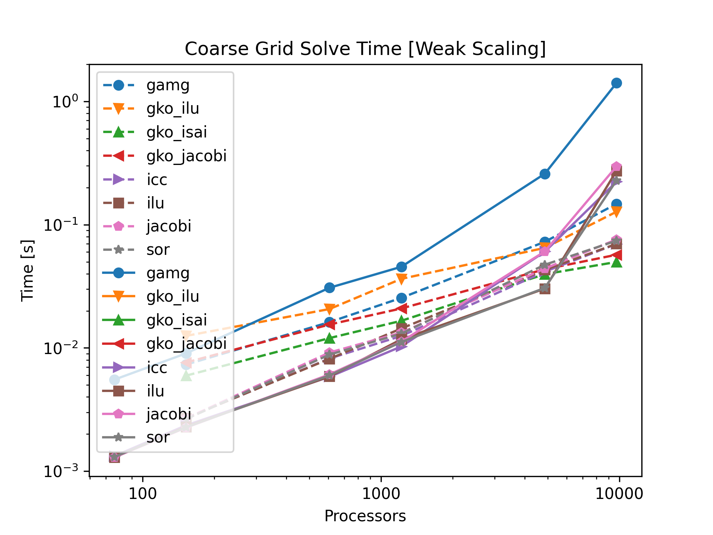
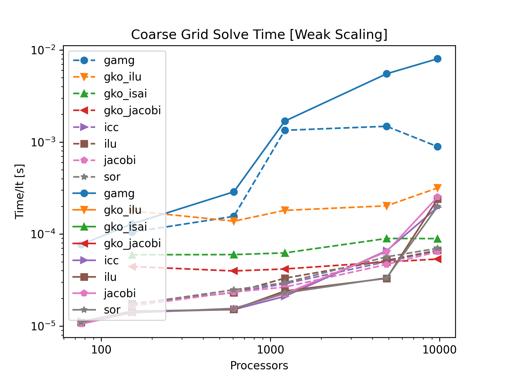
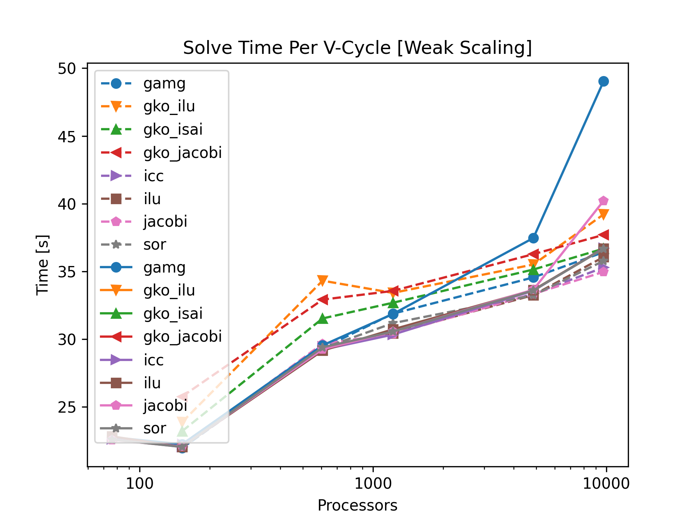

# Description of the current benchmarks

The benchmarks were run using
- hyteg:koch/integrating-ginkgo
- ginkgo:mpi-for-hyteg-with-rm
- petsc 3.16

## Problem Description
- Tokamak app with option for agglomeration
- Coefficient jump of order 1e6
- Jacobi smoother (3 pre&post steps)
- solve until rel. residual reduction < 1e-3 (~10 GMG iterations)
- Levels:
  - min_level = 0
  - max_level = 6
  - coarse refinement = 1..3
  - also change #toroidal_slices + #poloidal_slices (8+6/12+9)

## Scaling Setting
- 15-18 cells per process
  - 120-140 after agglomeration
- neighbors: 10, 70, 25 (min/max/avg)
- Problem size per process:
  - ~10 on coarse grid
  - 3e5-7e5 on fine grid
- Number of CPUs:
  - 1, 2, 8, 16, 64, 128 nodes (76 CPUs per node)
- Agglomerate to 1/8 processors
  - with GPU additional agglomerations from 1/8 to 1 processors
  - could go without agglomeration to 1 processor but that is too slow

## Results
Only CG solve time:
- Noticable uptick for un-agglomerated runs
- Only significant for largest number of processors
  - Except for AMG

Runtime per CG iteration:
- Runtime for GPU preconditioners nearly ideal
- Significant slower increase for agglomerated petsc
- AMG does something weird

Total GMG solve runtime:
- Higher uptick for un-agglomerated runs
  - only signigicant for largest number of processors
- Signigicant increase for AMG
  - ~1.5 times slower without agglomeration

## Issues
- can't use coarse_refinemen > 3 on horeka
  - already dies at coarse grid refinement due to OOM
- can't use more than ~10000 CPUs
- currently can't use ginkgo AMG
- very small coarse grid for GPU
- agglomeration from ginkgo side
